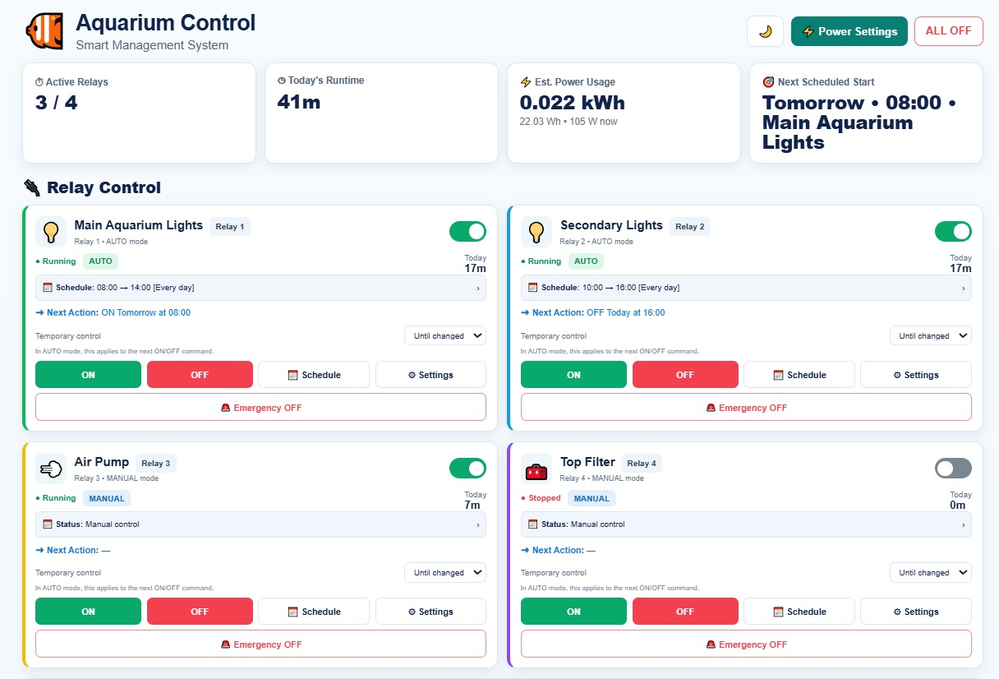
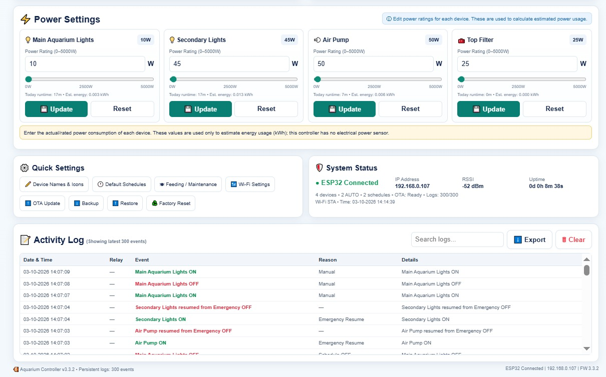
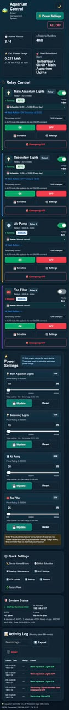
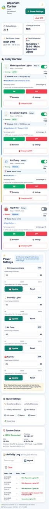
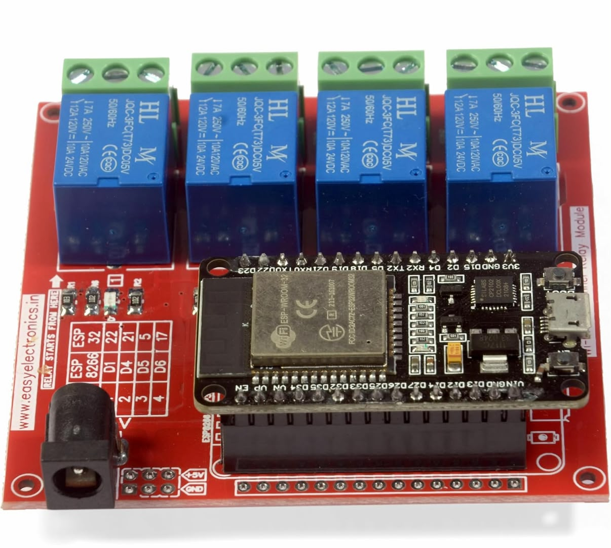

# ESP32 Smart Relay Controller

A Wi-Fi-enabled ESP32 relay controller with a responsive Smart Management dashboard, scheduling, runtime/power estimation, persistent activity logging, emergency control, feeding/maintenance pause, backup/restore, and OTA updates.

## Current stable release — v3.2.8

**v3.2.8 is the validated 4-relay aquarium-controller baseline.** It has been physically tested on the current ESP32 + 4-channel relay hardware.

## Next release — v3.2.9

**v3.2.9 is the updated 4-channel Smart Management UI and firmware development baseline.** It keeps the validated 4-channel GPIO mapping and controller architecture while adding the updated dashboard and management features.

### v3.2.9 highlights

- Updated Smart Management desktop dashboard
- Responsive mobile dashboard
- Light and dark themes
- 4 relay control cards with configurable names and icons
- AUTO / MANUAL operation
- Up to 6 schedules per relay
- Weekday and overnight scheduling
- Next scheduled action display
- Temporary manual control duration
- Per-relay Emergency OFF / Resume AUTO
- Emergency ALL OFF / Resume ALL
- Feeding / Maintenance schedule pause
- Runtime tracking and persistent activity logs (up to 300 events)
- Per-relay power rating configuration
- Estimated energy and power usage
- Browser backup/restore
- Wi-Fi configuration through the web interface
- Arduino OTA updates
- mDNS support
- Startup-safe relay initialization

> **Validation:** v3.2.9 is based on the tested 4-channel hardware configuration. The release should be promoted to the stable baseline only after the v3.2.9 firmware/CI/hardware validation cycle is complete.

### UI preview

The v3.2.9 UI is designed around the following sections:

- Summary cards: active relays, today's runtime, estimated energy usage, and next scheduled start
- Relay Control: status, mode, schedule, temporary control, ON/OFF, settings, and emergency control
- Power Settings: per-device wattage and estimated energy
- Quick Settings: device names/icons, default schedules, feeding/maintenance, Wi-Fi, OTA, backup/restore, and factory reset
- System Status: ESP32 connection, IP, RSSI, uptime, network/time information
- Activity Log: searchable and exportable persistent event history

### v3.2.9 UI screenshots

#### Desktop — Main Dashboard



#### Desktop — Power and Activity View



#### Mobile — Dark Theme



#### Mobile — Light Theme



## Hardware baseline

The validated hardware configuration uses an ESP32 development board and a 4-channel active-LOW relay board.

### 4-channel relay hardware



| Relay | ESP32 GPIO |
|---:|---:|
| 1 | GPIO 5 |
| 2 | GPIO 17 |
| 3 | GPIO 16 |
| 4 | GPIO 4 |

**These GPIOs are the validated 4-channel relay mapping for the current hardware.** The separate 8-channel development line uses a different GPIO mapping and remains independent from the v3.2.9 4-channel baseline.

**Relay logic:** the validated relay board is active-LOW: `LOW = Relay ON`, `HIGH = Relay OFF`.

> **Safety:** The ESP32 GPIOs control the low-voltage relay inputs. Any mains-voltage wiring must use suitable isolation, enclosure, protection, fusing, wire sizing, and components rated for the load, and should be installed by a qualified person. Software wattage values are estimates and are not electrical safety ratings.

## Firmware layout

```text
firmware/
├── v1.0.0/   # historical stable baseline
├── v2.0.1/   # historical development baseline
├── v3.2.8/   # validated 4-channel baseline
└── v3.2.9/   # updated 4-channel Smart Management baseline
```

Historical firmware is retained for traceability. New 4-channel development should start from v3.2.8 and be versioned forward; the separate 8-channel work remains on the v3.3.0 development line.

## Getting started

1. Install Arduino IDE and ESP32 board support.
2. Open the firmware version you want to validate from `firmware/<version>/`.
3. Select the appropriate ESP32 board.
4. Configure Wi-Fi through the controller setup/configuration interface.
5. Upload by USB for the initial installation.
6. Open the controller web interface using the ESP32 IP address or mDNS hostname when available.
7. Configure relay names, icons, wattages, schedules, weekdays, and modes.
8. Use OTA for subsequent firmware updates when the ESP32 is reachable on the network.

### Credentials

**Never commit personal Wi-Fi credentials, API keys, tokens, certificates, or other secrets.** The repository intentionally contains placeholder/default values only. Configure real credentials on the device.

## Scheduler behavior

Schedules are configured independently per relay. Each schedule contains:

- Start time
- Stop time
- Enabled state
- Selected weekdays
- Optional all-day/24×7 operation

AUTO mode applies the configured schedules. Manual control can temporarily override the next AUTO command when a duration is selected. Overnight schedules are supported.

## Feeding / Maintenance

The v3.2.9 dashboard provides a temporary Feeding / Maintenance function. Selected AUTO relays can have their schedule processing paused for a configured duration without changing the stored schedules.

## Emergency behavior

**Emergency ALL OFF** immediately turns all relays off while preserving their pre-emergency states. **Resume ALL** restores the states that were active immediately before the emergency action. Individual relays provide the same Emergency OFF / Resume AUTO behavior.

## Power and runtime

Power and energy values are software estimates based on the wattage configured for each relay and relay runtime. They are **not measurements from an electrical power meter**.

## OTA

The controller exposes Arduino OTA support after network initialization. Keep the ESP32 and development computer on the same reachable network and use the configured controller hostname/device entry for OTA updates.

## CI and validation

CI compilation does not replace physical hardware validation. For v3.2.9, validate:

- 4 relay GPIO operation: `5, 17, 16, 4`
- Active-LOW relay logic
- Manual ON/OFF
- AUTO scheduling
- Multiple schedules and weekdays
- Overnight schedules
- Temporary manual control
- Emergency OFF / Resume
- Feeding / Maintenance pause
- Runtime and power estimation
- Persistent activity logs
- Wi-Fi configuration
- Backup/restore
- OTA
- Desktop and mobile UI
- Light/dark themes

## Repository structure

```text
ESP32-Smart-Relay-Controller/
├── firmware/       # versioned firmware
├── docs/            # user and developer documentation
├── hardware/       # board and wiring references
├── profiles/       # reusable application configuration examples
├── examples/       # application examples
└── .github/         # repository automation
```

## Development policy

The v3.2.8 firmware remains the known-good validated baseline until v3.2.9 completes its firmware, CI, and hardware validation cycle. The v3.3.0 8-channel development line is maintained separately and must not be mixed with the 4-channel v3.2.9 release.

## License

This project is released under the MIT License. See [LICENSE](LICENSE).
