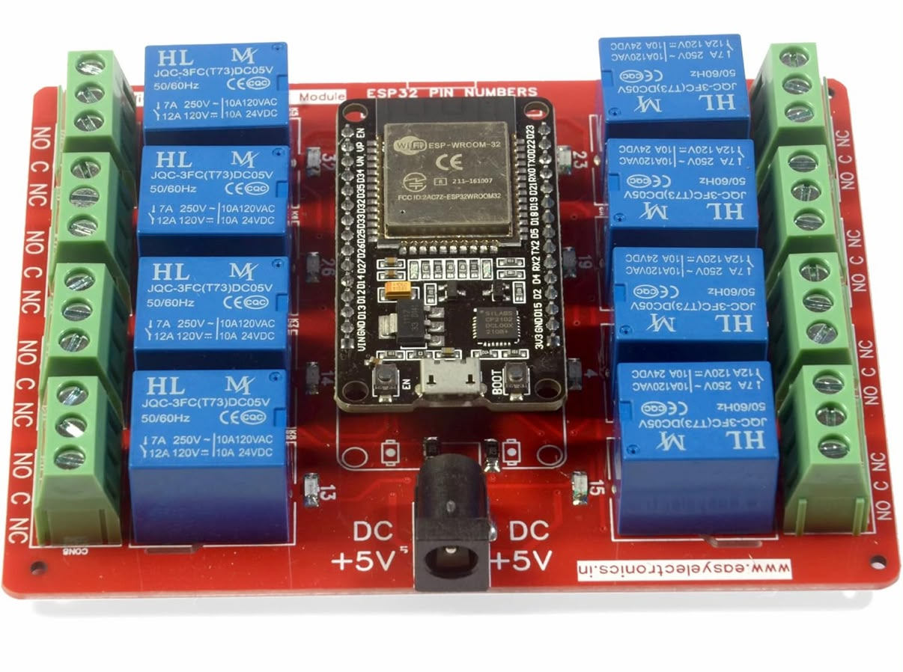
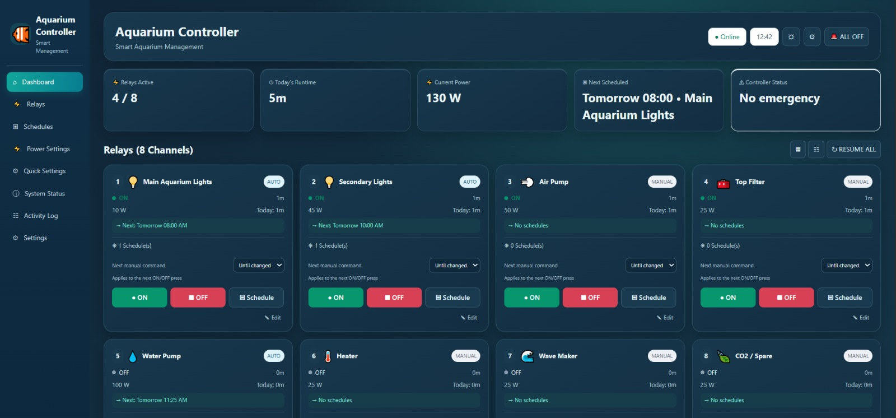
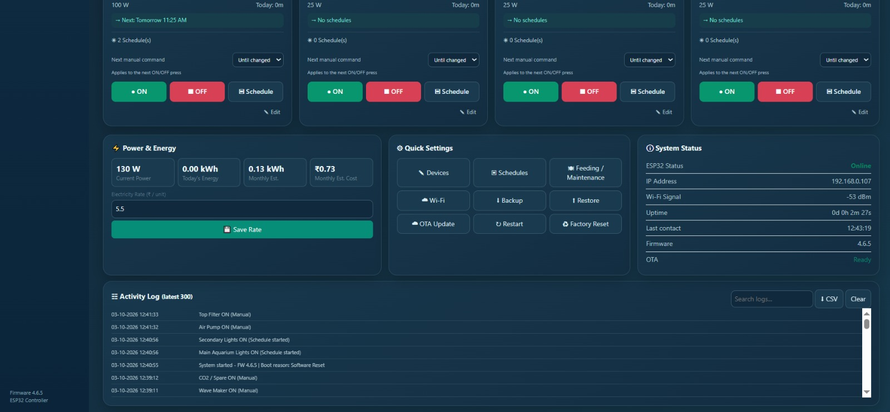
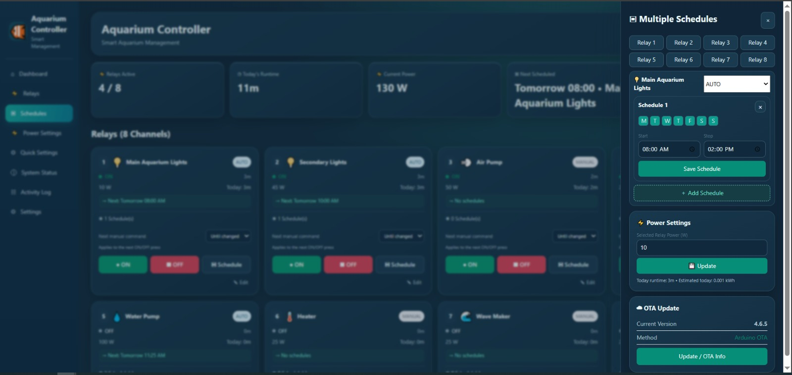
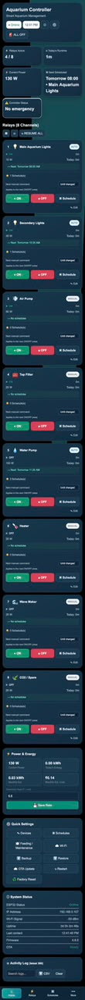
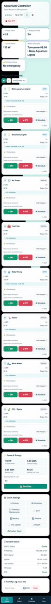

# ESP32 Smart Relay Controller

A Wi-Fi-enabled ESP32 relay controller with a responsive web dashboard, scheduling, runtime/power estimation, persistent activity logging, emergency control, and OTA updates.

## Current stable release — v3.2.8

**v3.2.8 is the validated 4-relay aquarium-controller baseline.** It has been physically tested on the current ESP32 + 4-channel relay hardware.

### Validated features

- 4-channel relay control
- Fast manual ON/OFF response
- AUTO / MANUAL modes
- Up to 6 schedules per relay
- Weekday scheduling
- Overnight schedules
- Automatic schedule ON/OFF execution
- Next scheduled action display
- Emergency ALL OFF with previous-state resume
- Per-relay emergency OFF / resume
- NTP / IST time synchronization
- Timestamped activity log
- Persistent settings and logs
- Runtime tracking
- Estimated power and energy usage
- Estimated electricity cost
- Configurable relay names and icons
- Wi-Fi configuration through the web interface
- Responsive desktop/mobile dashboard
- Light/dark theme
- Browser backup/restore
- Arduino OTA updates
- mDNS support
- Startup-safe relay initialization

## Hardware baseline

The validated stable hardware configuration uses an ESP32 development board and a 4-channel active-LOW relay board.

### 4-channel relay hardware

The project uses the following 4-channel relay configuration as its validated v3.2.8 hardware baseline:


| Relay | ESP32 GPIO |
|---:|---:|
| 1 | GPIO 5 |
| 2 | GPIO 17 |
| 3 | GPIO 16 |
| 4 | GPIO 4 |

**These GPIOs are the validated 4-channel relay mapping for the current v3.2.8 stable hardware.**

> **Safety:** The ESP32 GPIOs control the low-voltage relay inputs. Any mains-voltage wiring must use suitable isolation, enclosure, protection, fusing, wire sizing, and components rated for the load, and should be installed by a qualified person. Software wattage values are estimates and are not electrical safety ratings.

## 8-channel development baseline — v3.3.0

The repository now contains the validated 8-channel firmware development baseline in `firmware/v3.3.0/`. This expands the controller from four to eight independently configurable relay channels while retaining the tested scheduling, emergency control, runtime/power estimation, activity logging, responsive UI, and OTA functionality.

**v3.3.0 is a development/validation baseline until the 8-channel hardware and CI validation cycle is complete. The v3.2.8 release remains the stable release.**

### 8-channel GPIO mapping

| Relay | ESP32 GPIO |
|---:|---:|
| 1 | GPIO 19 |
| 2 | GPIO 18 |
| 3 | GPIO 5 |
| 4 | GPIO 17 |
| 5 | GPIO 32 |
| 6 | GPIO 33 |
| 7 | GPIO 25 |
| 8 | GPIO 14 |

The 8-channel firmware uses an active-LOW relay board: `LOW = ON`, `HIGH = OFF`.

### 8-channel hardware



### 8-channel desktop dashboard

The desktop dashboard provides relay status, manual controls, AUTO/MANUAL state, schedules, runtime, power information, system status, quick settings, and activity logging.





### Multiple schedules

The scheduler supports multiple schedules per relay, weekday selection, start/stop times, and per-relay configuration.



### Responsive mobile UI

The controller provides a responsive mobile layout and supports both dark and light themes.





## Firmware layout

```text
firmware/
├── v1.0.0/   # historical stable baseline
├── v2.0.1/   # historical development baseline
├── v3.2.8/   # current validated 4-channel stable release
└── v3.3.0/   # validated 8-channel development baseline
```

Historical firmware is retained for traceability. New 4-channel fixes should start from v3.2.8, while 8-channel development should continue from v3.3.0.

## Getting started

### Stable 4-channel controller

1. Install Arduino IDE and ESP32 board support.
2. Open the v3.2.8 firmware from `firmware/v3.2.8/`.
3. Select the appropriate ESP32 board.
4. Configure Wi-Fi through the controller setup/configuration interface.
5. Upload by USB for the initial installation.
6. Open the controller web interface using the ESP32 IP address or mDNS hostname when available.
7. Configure relay names, wattages, schedules, weekdays, and modes.
8. Use OTA for subsequent firmware updates when the ESP32 is reachable on the network.

### 8-channel development firmware

For the 8-channel development baseline, open `firmware/v3.3.0/ESP32_Smart_Relay_Controller.ino`. The firmware defines eight relay channels using the GPIO mapping documented above.

### Credentials

**Never commit personal Wi-Fi credentials, API keys, tokens, certificates, or other secrets.** The repository intentionally contains placeholder/default values only. Configure real credentials on the device.

## Scheduler behavior

Schedules are configured independently per relay. Each schedule contains:

- Start time
- Stop time
- Enabled state
- Selected weekdays

AUTO mode applies the configured schedules. Manual control remains available according to the controller's manual-override rules. Overnight schedules are supported.

## Emergency behavior

**Emergency ALL OFF** immediately turns all relays off while preserving their pre-emergency states. **Resume ALL** restores the states that were active immediately before the emergency action.

## Power and runtime

Power and energy values are software estimates based on the wattage configured for each relay and the measured relay runtime. They are **not measurements from an electrical power meter**.

## OTA

The controller exposes Arduino OTA support after network initialization. Keep the ESP32 and development computer on the same reachable network and use the configured controller hostname/device entry for OTA updates.

## CI

GitHub Actions validates the supported firmware targets and mapping checks. CI compilation does not replace physical hardware validation.

## Repository structure

```text
ESP32-Smart-Relay-Controller/
├── firmware/       # versioned firmware
├── docs/            # user and developer documentation
│   └── images/     # UI and hardware documentation images
├── hardware/       # board and wiring references
├── profiles/       # reusable application configuration examples
├── examples/       # application examples
└── .github/        # repository automation
```

## Development policy

The v3.2.8 firmware remains the known-good 4-channel stable baseline. The v3.3.0 firmware is the 8-channel development/validation baseline. Bug fixes should preserve validated relay-control, scheduler, emergency-resume, timing, and UI behavior. New features should be developed as a new version and physically validated before replacing a stable baseline.

## License

This project is released under the MIT License. See [LICENSE](LICENSE).
